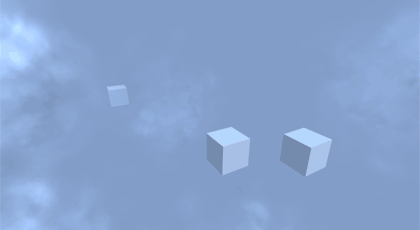
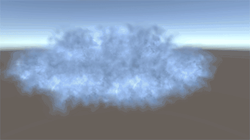

# Billboard Based Nebula
Space nebula that can be flown around and inside. The mechanics behind how this work are heavily inspired by Freelancer, which had a very clever, but simple and effective method for this. This was originally built into [the Cockpit project from a couple years ago](http://why485.tumblr.com/tagged/cockpit-1.0). I was always pretty happy with how it turned out. The concepts behind it are very simple, but it's pretty effective.

That being said, I'm not completely happy with how some of it is implemented. It's not the easiest thing to port to a new project, and it requires more scene specific setup than I'm comfortable with. It also relies on the old Unity fog, which is slowly being deprecated and doesn't work correctly with deferred rendering.

Regardless, it was a very interesting project and thought it was worth sharing.

This project was built with Unity 5.6.2.

## Screenshots

Interior

Exterior

Transition

## Notes
While I did build this with the idea of eventually separating it out, it never reached the level of polish required for a proper release.

There's a few TODOs in the code from parts that I quickly hacked together to make this work separate from its source project. The scene included shows how everything has to be set up, but it's not completely clear. I'll try and update this readme with more information. I'd also like to eventually come back to this and clean it up a bit to make it more user friendly.

There is an issue with fog rendering when built. When inside nebula, if you don't see fog shading being applied correctly, in Unity's graphics settings, set "Fog modes" under "Shader stripping" to Custom.
